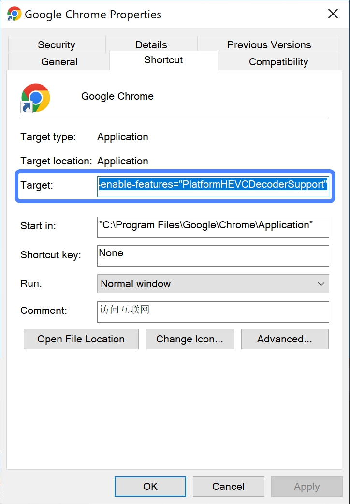

# enable-chromium-hevc-hardware-decoding

A guide that teach you enable hardware HEVC decoding for Chrome / Edge on macOS / Windows, or build a custom version of Chromium / Electron that supports hardware & software HEVC decoding.

##### English | [简体中文](./README.zh_CN.md)

## Download Link

### Release Version

#### Chrome
[Click to Download](https://www.google.com/chrome/) (version >= 104.0.5084.0).

#### Edge (Mac)
[Click to Download](https://www.microsoft.com/edge) (version >= 104.0.1293.0).

### Software Decoding Compatible Version

#### Chromium
[Click to Download](https://github.com/StaZhu/enable-chromium-hevc-hardware-decoding/releases) (Support HW + SW decoding, no platform requirement).

## Usage

### Release Version

#### Chrome (Windows)
Append switch `--enable-features=PlatformHEVCDecoderSupport` to desktop shortcut and open directly.

#### Chrome (Mac)
Unzip the file [Google Chrome with HEVC.app.zip](./resources/Google%20Chrome%20with%20HEVC.app.zip), then drag `Google Chrome with HEVC.app` to `Applications` directory and open directly.

#### Edge (Mac)
Unzip the file [Microsoft Edge with HEVC.app.zip](./resources/Microsoft%20Edge%20with%20HEVC.app.zip), then drag `Microsoft Edge with HEVC.app` to `Applications` directory and open directly.

### Software Decoding Compatible Version

#### Chromium
Open directly.

## What's the hardware supported HEVC profile?

HEVC Main (Up to 8192x8192 pixels)

HEVC Main 10 (Up to 8192x8192 pixels)

HEVC Main Still Picture (macOS only, up to 8192x8192 pixels)

HEVC Rext (Partial support, see the table below for details, up to 8192x8192 pixels)

|        GPU             | 8b 420 | 8b 422 | 8b 444 | 10b 420 | 10b 422 | 10b 444 | 12b 420 | 12b 422 | 12b 444 |
| :--------------------- | :----- | :----- | :----- | :------ | :------ | :------ | :------ | :------ | :------ |
|  Apple Silicon (macOS) |   ✅  |   ✅   |   ✅  |    ✅   |   ✅   |   ✅    |   ❌   |   ❌    |   ❌   |
| Intel ICL ~ TGLx (Win) |   ✅  |   ⭕   |   ⭕  |    ✅   |   ✅   |   ✅    |   ❌   |   ❌    |   ❌   |
|    Intel TGLx+ (Win)   |   ✅  |   ⭕   |   ⭕  |    ✅   |   ✅   |   ✅    |   ✅   |   ⭕    |   ⭕   |

✅：GPU + software support
⭕：GPU support, software not support
❌：GPU not support

#### Note 1：Intel CPU Mac supports HEVC Rext software decoding of 8 ~ 12b non-444 contents via VideoToolbox, 444 is decodable but has a green stripe issue.
#### Note 2：Specific Intel GPU supports HEVC Rext hardware decoding on Windows, so if you want to use these profiles then Chromium version must be >= 106.0.5210.0. Some profiles are not common so we only implement part of them, if you need those unsupported profile that GPU do supports, then you can submit a issue to `crbug.com`.
#### Note 3：Although NVIDIA GPU supports HEVC Rext hardware decoding of 8 ~ 12b non-422 contents via CUVIA or NVDEC, but because they did not provide a D3D11 interface, thus Chromium will not support it in the future.

## What's the OS requirement?

macOS Big Sur (11.0) and above

Windows 8 and above

Android (already support, not tested)

ChromeOS (already support, not tested)

## What's API supported?

Currently supports HTML Video Element, Media Source Extension, Clearkey Encrypted Media Extensions, WebCodec (8bit only, version >= 107.0.5272.0), no support for WebRTC and video encode.

## What's the GPU requirement?

#### Independent GPU

NVIDIA GTX950 and above

AMD RX460 and above

#### Integrated GPU

Intel HD4400, HD515 and above

AMD Radeon R7, Vega M and above

Apple M1, M1 Pro, M1 Max, M1 Ultra and above

#### Detail Table

[Intel](https://bluesky-soft.com/en/dxvac/deviceInfo/decoder/intel.html)

[AMD](https://bluesky-soft.com/en/dxvac/deviceInfo/decoder/amd.html)

[NVIDIA](https://bluesky-soft.com/en/dxvac/deviceInfo/decoder/nvidia.html)

## HDR Supports? (Compared with Edge / Safari)

|                  | PQ (SDR Screen) | PQ (HDR Screen) | HLG (SDR Screen) | HLG (HDR Screen) |
| :-------------- | :------------- | :------------- | :-------------- | :-------------- |
|  Chromium 105 macOS  |     ✅ (EDR)      |        ✅        |      ✅ (EDR)      |        ✅         |
| Chromium 105 Windows |        ✅        |        ✅        |        ✅         |        ✅         |
|   Edge 102 Windows   |        ❌        |        Partial        |        Partial         |        ❌         |
|   Safari 15.3 macOS   |     ✅ (EDR)      |        ✅        |      ✅ (EDR)      |        ✅         |

## Dolby Vision Supports?
Support HLG、PQ backward compatibility single layer dolby vision (Profile 8.1, 8.2, 8.4), not support IPTPQc2 single layer dolby vision (Profile 5), not support multi layer dolby vision, not support dolby atmos audio (E-AC3).

## What's the tech diff? (Compared with Edge / Safari)

#### Windows

Edge uses `VDAVideoDecoder` to call `MediaFoundation` (need to install `HEVC Video Extension`) to finish the HEVC HW decoding which is the same tech behind `Movies and TV` builtin system app.

Chromium uses `D3D11VideoDecoder` to call `D3D11VA` (no need to install anything) to finish the HEVC HW decoding which is the same tech behind video players like `VLC`.

#### macOS

Safari and Chromium use the same `VideoToolbox` to finish the HEVC HW decoding.

## How to verify HEVC hardware support is enabled?

1. Open `chrome://gpu`, and search `Video Acceleration Information`, you should see **Decode hevc main** field and **Decode hevc main 10** field  (macOS will show **Decode hevc main still-picture** and **Decode hevc range extensions** as well)  present if hardware decoding is supported (macOS is an exception here, you see this field doesn't means the decode will use hardware, it actually depends on your GPU).
2. Open `chrome://media-internals` and play some HEVC video ([Test Page](https://lf-tk-sg.ibytedtos.com/obj/tcs-client-sg/resources/video_demo_hevc.html)) if the decoder is `VDAVideoDecoder` or `D3D11VideoDecoder` or `VaapiVideoDecoder` that means the video is using hardware decoding (macOS is an exception here, if the OS >= Big Sur, and the GPU doesn't support HEVC, VideoToolbox will fallback to software decode which has a better performance compared with FFMPEG, the decoder is `VDAVideoDecoder` in this case indeed), and if the decoder is `FFMpegVideoDecoder` that means  the video is using software decoding.
3. Open `Activity Monitor` on Mac and search `VTDecoderXPCService`, if the cpu usage larger than 0 when playing video, that means hardware (or software) decoding is being used.
4. Open `Windows Task Manager` on Windows and switch to `Performance` - `GPU`, if `Video Decoding` usage larger than 0 when playing video,  that means hardware decoding is being used.

## Why my GPU support HEVC, but still not able to hardware decode?

#### OS version is too low

##### Windows

Please make sure you are using Windows 8 and above, this is because the `D3D11VideoDecoder` doesn't support Windows 7, and will use `VDAVideoDecoder` to hardware decoding. while `VDAVideoDecoder` based on `Media Foundation` , and `Media Foundation` start to support HEVC since Windows 10 1709 (which need you to install the `HEVC Video Extension`).

##### macOS

Please make sure you are using macOS Big Sur and above, this is because `CMVideoFormatDescriptionCreateFromHEVCParameterSets`  API has compatibility issue on lower macOS.

#### GPU driver has bug

Some GPU driver may has bug which will cause `D3D11VideoDecoder` forbidden to use. in this case, you need to upgrade your GPU driver and try again. [See reference](https://source.chromium.org/chromium/chromium/src/+/main:gpu/config/gpu_driver_bug_list.json?q=disable_d3d11_video_decoder)

#### GPU hardware has bug

Some GPU hardware may has bug which will cause `D3D11VideoDecoder` forbidden to use. in this case, we can't do anything else but to use the FFMPEG software decode. [See reference](https://source.chromium.org/chromium/chromium/src/+/main:gpu/config/gpu_driver_bug_list.json?q=disable_d3d11_video_decoder)

## Will HEVC decoding be enabled in Chrome by default in the future?

Chrome 104 and above version will integrate HEVC hw support for ChromeOS, Mac, Windows and Android, disabled by default, and you can enable it by passing `--enable-features=PlatformHEVCDecoderSupport` when opening. it should be enabled by default in the future version when stable. (only platform decoder that provided by the OS will be supported in chrome, thus this will be optional depends on the GPU and OS support)

## How to Build?

1. Follow [the official build doc](https://www.chromium.org/developers/how-tos/get-the-code/) to prepare the build environment then fetch the source code from `main` branch (HEVC HW codes has been merged).
2. (Optional) To enable HEVC software decoding: switch to `src/third_party/ffmpeg` dir, then execute `git am /path/to/add-hevc-ffmpeg-decoder-parser.patch`.
3. (Optional) To enable other HEVC profiles (non main / main 10 profiles): switch to `src` dir, then execute `git am /path/to/remove-main-main10-profile-limit.patch`.
4. (Optional) To default enable hardware decode: switch to `src` dir, then execute `git am /path/to/enable-hevc-hardware-decoding-by-default.patch`.
5. (Optional) To integrate Widevine CDM to support EME API (like Netflix): switch to `src` dir, then execute `cp -R /path/to/widevine/* third_party/widevine/cdm` (Windows: `xcopy /path/to/widevine third_party\widevine\cdm /E/H`).
6. If you are using `Mac` + want to build `x64` arch (target_cpu to `x86` , `arm64` , `arm` also available) + want to add CDM support, then run `gn gen out/Release64 --args="is_component_build = false is_official_build = true is_debug = false ffmpeg_branding = \"Chrome\" target_cpu = \"x64\" proprietary_codecs = true media_use_ffmpeg = true enable_widevine = true bundle_widevine_cdm = true enable_platform_hevc = true enable_hevc_parser_and_hw_decoder = true"`, if you are using `Windows`, you need to add `enable_media_foundation_widevine_cdm = true` as well, if you are using `Windows` and want to build `arm64` arch, then need to change `bundle_widevine_cdm` to `false`.
7. Run `autoninja -C out/Release64 chrome` to start the build.
8. Run `./out/Release64/Chromium.app/Contents/MacOS/Chromium --args --enable-features=PlatformHEVCDecoderSupport` to open chromium if you are using macOS.
9. Create a desktop shortcut and passing the args like `C:\Users\Admin\Desktop\Chromium\chrome.exe --enable-features=PlatformHEVCDecoderSupport` then double click the desktop shortcut to open chromium if you are using Windows.

## How to integrate this into Chromium based project like Electron?

If Electron >= v20.0.0 (Chromium >= v104.0.5084.0), the HEVC hw decoding feature for Mac and Windows should have already been integrated, and you can use `app.commandLine.appendSwitch('enable-features', 'PlatformHEVCDecoderSupport')` to enable HEVC hw decoding. To add HEVC ffmpeg sw decoding, the method should be the same with Chromium guide above.

If Electron < v20.0.0, please follow the CL in `Trace Crbug` to manually integrate HEVC features. Pull request of Patches for different version of Electron are welcome.

## Change Log

`2022-08-31` Add WebCodec API (8bit only) support, and HEVC with alpha layer support (macOS only)

`2022-08-06` Update usage to Edge (Mac) 104 release version

`2022-08-02` Update usage to Chrome 104 release version

`2022-08-01` Add Chrome / Edge Usage

`2022-07-31` Intel GPU support HEVC Rext Profile hw decoding on Windows, Update Patch to `106.0.5211.0`

`2022-07-15` Update Electron v20.0.0-beta.9 and above version support status

`2022-06-21` Update Microsoft Edge (Mac) feature test guide

`2022-06-18` Fix HLG/PQ tone mapping, and update Patch to `105.0.5127.0`

`2022-06-17` Remove Linux support, Update Other Platform and HDR support status

`2022-05-26` Update Chrome Canary HEVC feature test guide

`2022-05-25` Update Chrome 104 support status, and Electron 20 enable method

`2022-05-24` Update Patch to `104.0.5080.1`

`2022-05-23` Add CDM compile guide, and update Patch to `104.0.5077.1`

`2022-05-17` Update detail of tech implement and guide to integrate into electron

`2022-05-14` Update Patch to `104.0.5061.1`

`2022-05-13` Add HEVC Test page

`2022-05-10` Update README, add more special detail of the hardware support and GPU models

`2022-05-05` Add support for MSP & Rext on macOS, and fix the issue that some HDR & Rec.709 Main10 video can't be hw decoded on Windows

`2022-04-27` Replace to `git am` patch

`2022-04-24` Support chinese README

`2022-04-21` Add Crbug trace

`2022-04-20` Modify README

`2022-04-19` Initial commit

## Trace Crbug

##### [Windows](https://crbug.com/1286132)

##### [macOS](https://crbug.com/1300444)

## License

MIT
